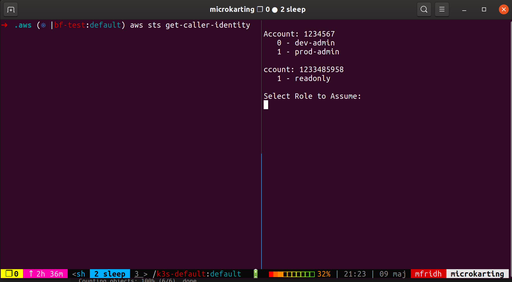

# aws-okta-tmux

Wrapper that makes aws-okta cred-process communicate with the user via tmux panes.

## Usage

- Place `aws-okta-tmux` somewhere on your `$PATH`.
- Replace `aws-okta` with `aws-okta-tmux` in your `~/.aws/config`.

## Screenshot



## Examples

Example `~/.aws/config` contents:

```ini
[default]
region = eu-west-1

[profile okta]
aws_saml_url = app/fulhackindustries/excorcismneeded/sso/saml
region = eu-west-1

# Unspecific profiles, using any of these with the aws cli might pop up a list
# of roles for you to choose from. Depending on your saml configuration.
[profile default]
source_profile = okta
credential_process = aws-okta-tmux cred-process okta

[profile foo]
source_profile = okta
credential_process = aws-okta-tmux cred-process okta

[profile bar]
source_profile = okta
credential_process = aws-okta-tmux cred-process okta

# Specific target roles - usable by `aws-okta` directly only.
# Actual AWS SDK roles defined later.
[profile fulhack_dev_admin]
role_arn = arn:aws:iam::6666666666:role/fulhack-dev-admin

[profile fulhack_prod_admin]
role_arn = arn:aws:iam::6666666666:role/fulhack-prod-admin

# Useable AWS CLI/SDK profiles (Usable from AWS SDK tools such as AWS CLI)
[profile dev]
credential_process = aws-okta-tmux cred-process fulhack_dev_admin

[profile prod]
credential_process = aws-okta-tmux cred-process fulhack_prod_admin

```

### Details

Now, there are only two profiles here which are usable by the *AWS CLI* - `dev` and `prod`.
The others are for `aws-okta`, such as: `aws-okta login fulhack_dev_admin` to take you to the *AWS Console*.

### EKS Cluster sync

```sh
AWS_PROFILE=dev aws eks update-kubeconfig --name cluster_name --alias cluster_name
```

If you do this, the configuration should end up with an `AWS_PROFILE` environment variable set in the Kubernetes configuration file and thus `kubectl` commands should be able to be run without any other tricks needed.

